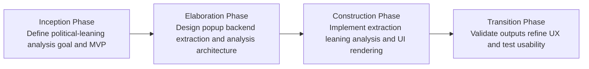
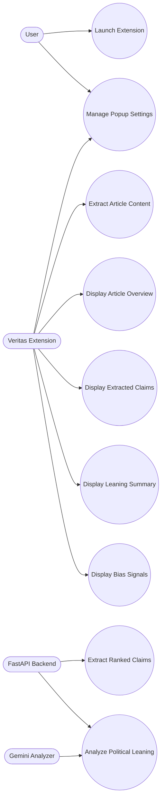
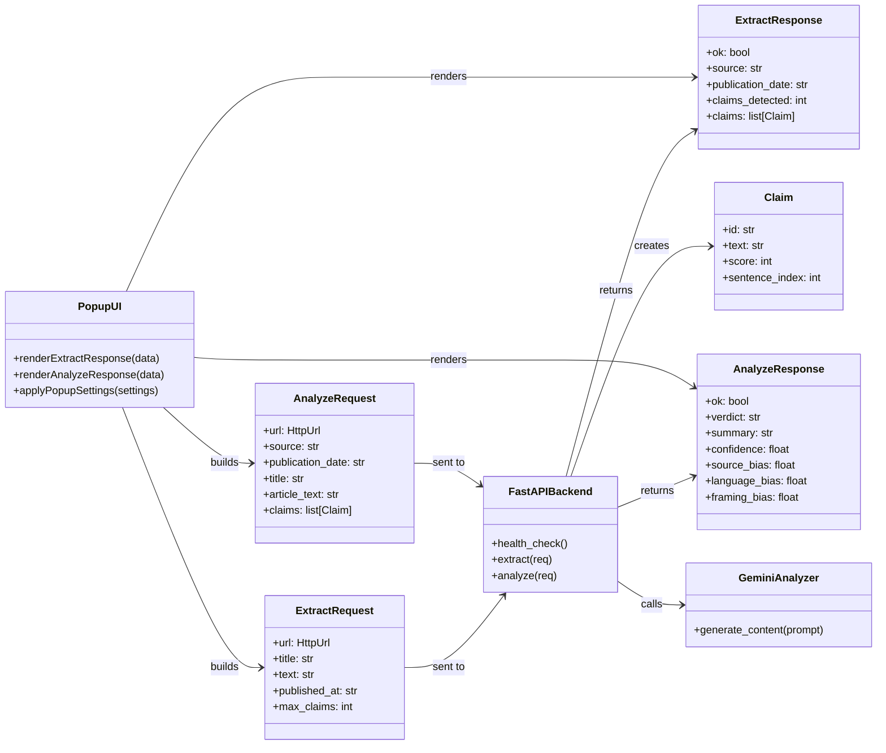
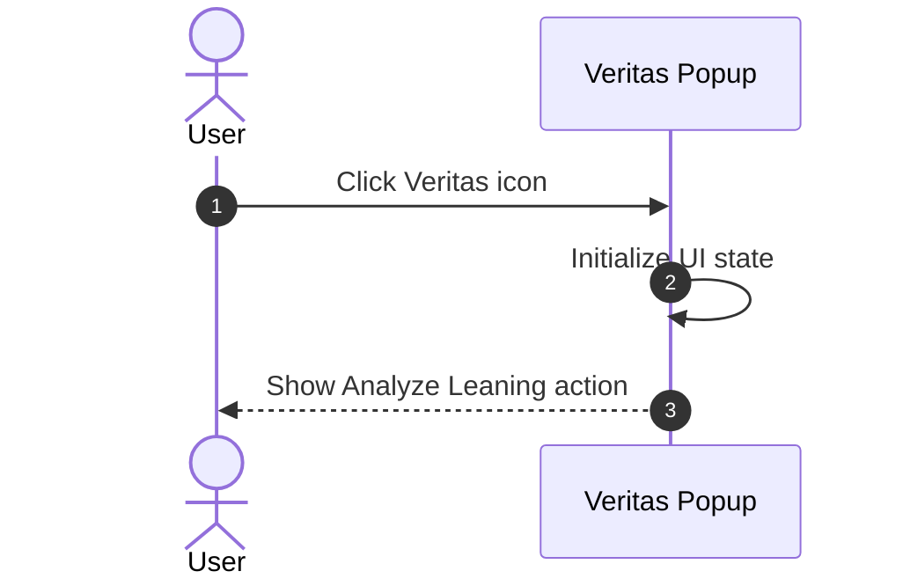
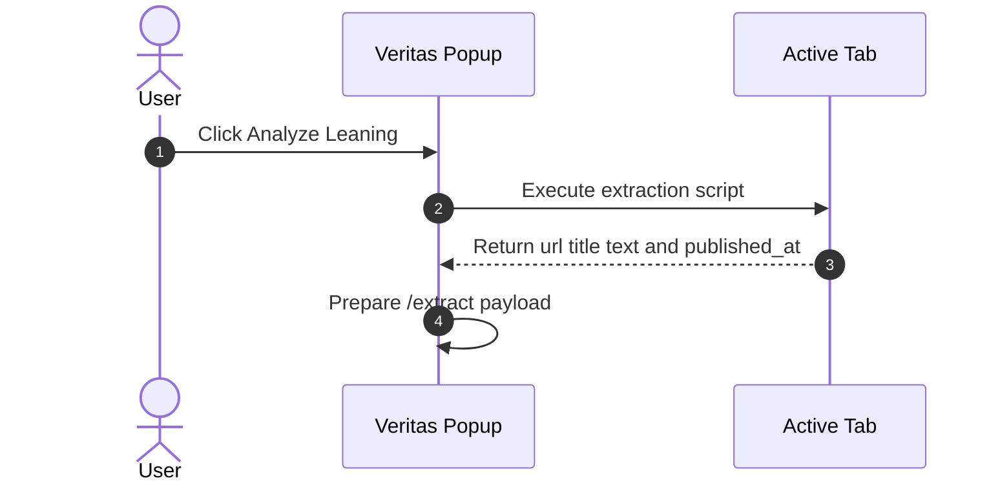
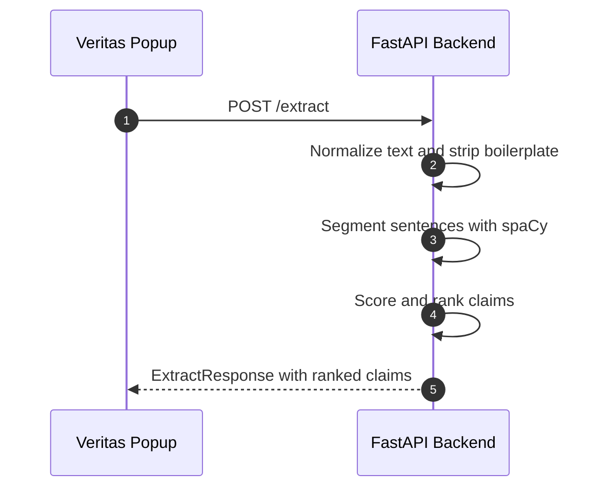
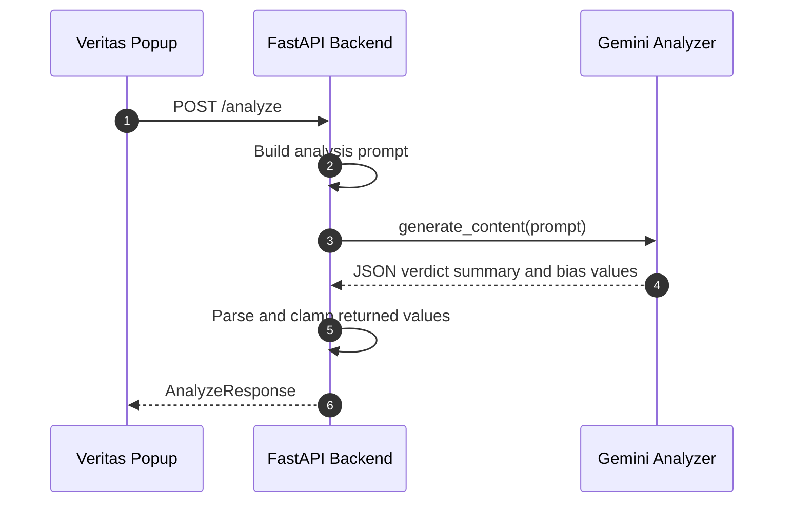
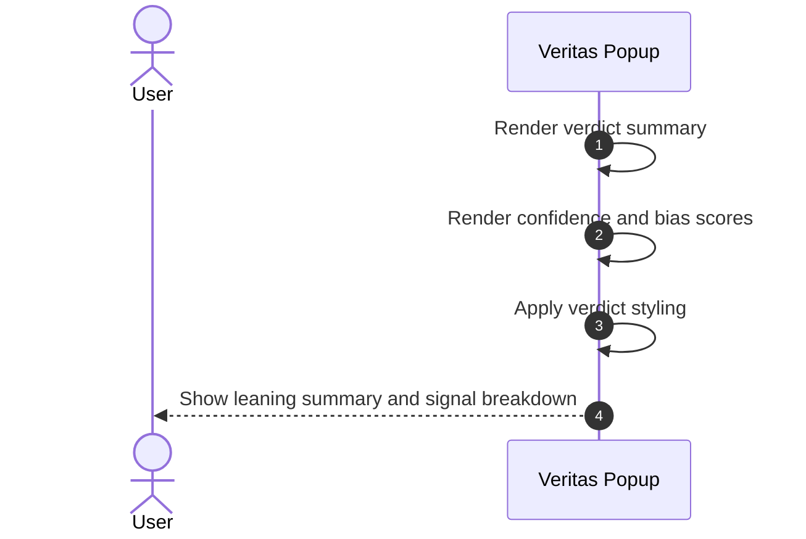

# Abstract
This Capstone project implements an automated political leaning analysis system designed to evaluate online news articles in real time. Veritas operates as a Chrome browser extension that extracts visible article text, derives ranked claim candidates, and estimates the article's political framing using an AI-assisted backend pipeline. The system uses a FastAPI backend for text processing, metadata normalization, claim extraction, and leaning analysis, while a Gemini-powered analysis step estimates political orientation based on source bias, language bias, and framing bias. Rather than functioning as a fake news detector or truth-verification engine, the current Veritas model focuses on identifying editorial leaning and presentation patterns within political content. Development follows the Unified Software Development Process, allowing the system to evolve iteratively through structured requirements, architecture, implementation, and testing.

# 1. Introduction
Digital news consumption has made it easier than ever for readers to access political information quickly, but it has also made it harder to recognize how language, framing, and source reputation shape interpretation. Many existing tools focus on determining whether a statement is true or false, but political articles often influence readers through subtler mechanisms such as selective emphasis, emotionally charged language, or one-sided framing. These factors may not make an article factually false, yet they still affect how the content is perceived.

Veritas addresses this problem by shifting away from fake news detection and toward political leaning estimation. Instead of judging whether an article is simply true or false, Veritas analyzes the article’s source, wording, and framing to estimate whether the content appears Left-leaning, Center-left, Center, Center-right, Right-leaning, or Unclear. This allows the system to provide readers with structured context about how political information is being presented, while still exposing the article metadata and extracted claims that informed the result.

## 1.1 Purpose of the System
The purpose of the Veritas system is to provide users with a real-time estimate of an article’s political leaning by analyzing article metadata, extracted claims, and broader textual framing signals.

## 1.2 Scope of the System
Figure 1 shows the current high-level workflow of Veritas. When a user opens the extension while viewing a news article, the popup extracts the page URL, article title, visible article text, and publication date when available. That information is first sent to the `/extract` endpoint, which normalizes the date, identifies the article source, and ranks candidate claims using lightweight natural language processing. The extracted claims, together with the article title and article text, are then sent to the `/analyze` endpoint. The backend forwards this structured information to a Gemini-based analysis step, which estimates political leaning using three primary signals: source bias, language bias, and framing bias. The backend then returns a verdict, summary, confidence value, and bias signal scores to the extension, which displays them in the popup UI.

### Figure 1.

```mermaid
flowchart LR

A[User clicks Veritas icon] --> B[Popup extracts URL title article text and publication metadata]
B --> C[Extension sends article payload to FastAPI /extract]
C --> D[FastAPI normalizes metadata and extracts ranked claims]
D --> E[Extension sends article context plus claims to FastAPI /analyze]
E --> F[Gemini-based analyzer estimates political leaning]
F --> G[Backend returns verdict summary confidence and bias signals]
G --> H[Popup renders overview claims leaning summary and bias values]
```

## 1.3 Development Methodology (USDP)
The development of Veritas follows the Unified Software Development Process. This methodology is appropriate because Veritas combines multiple interacting components, including a browser extension interface, a FastAPI backend, a lightweight NLP extraction stage, and an AI-assisted leaning classifier. USDP supports the project through iterative development cycles while preserving a strong architectural structure.

During the Inception Phase, the system’s original direction was reevaluated and narrowed into a more specific political leaning analysis tool. This helped define the minimum viable product around article extraction, claim identification, and leaning estimation rather than generic misinformation detection.

During the Elaboration Phase, the team designed the architecture connecting the popup interface, extraction endpoint, analysis endpoint, and Gemini model call. At this stage, special attention was given to how article text would be collected, how candidate claims would be ranked, how bias signals would be represented numerically, and how the results would be displayed clearly in the popup.

During the Construction Phase, the system was implemented incrementally. The extension was built to capture article content from the active tab, the backend was built to normalize and extract structured claims, and the analysis stage was designed to classify political leaning while returning confidence and signal values in a strict JSON format.

During the Transition Phase, the focus shifts toward validation, usability testing, and refinement of how leaning results are presented. This includes improving extraction quality, tuning prompts, clarifying limitations, and ensuring that users understand the output as an estimate of editorial leaning rather than a definitive political fact.

### Figure 2.

# 2. Current System
Most users currently rely on one of the following approaches when trying to understand the political orientation of an online article:

1. **Personal Interpretation:**  
Readers manually judge tone, wording, and framing on their own. This is subjective, inconsistent, and often influenced by the reader’s own assumptions.

2. **Source Reputation Heuristics:**  
Some readers rely only on the publisher’s reputation or public image to decide whether an article leans left or right. This can be useful, but it ignores the actual wording and framing of a specific article.

3. **Fact-Checking Tools:**  
Traditional fact-checking systems are designed to verify factual claims, not estimate political presentation or editorial slant. As a result, they do not directly answer whether an article is politically framed in a particular direction.

Veritas improves on these approaches in several ways:

1. **Article-Level Leaning Estimation:**  
Instead of judging only the domain or only isolated facts, Veritas evaluates the full article context, including the title, article text, and extracted claims.

2. **Multi-Signal Analysis:**  
The system breaks the estimate into source bias, language bias, and framing bias, making the output easier to interpret and less opaque.

3. **Structured Claim Extraction:**  
Before analysis, Veritas identifies ranked claim candidates from the article so the system preserves the most information-dense statements for downstream processing.

4. **Immediate In-Browser Feedback:**  
Users do not need to leave the article to get a leaning estimate. Results are shown directly in the popup interface.

# 3. Project Plan
This project is developed by a team that includes Diego Martinez, Christian Cevallos, Justin Cardenas, and Jhonny Felix. Diego serves as team lead and active developer, coordinating Scrum activities, defining iteration goals, and helping guide overall architecture. The team follows a Scrum-based structure with short iterative cycles, allowing the project to evolve through continuous feedback and refinement.

The current development focus is no longer centered on fake news classification. Instead, the project plan emphasizes three technical goals: improving article extraction reliability, strengthening the quality of political leaning estimation, and presenting the results in a way that is understandable and transparent to users. This includes continued refinement of prompt design, backend validation, popup rendering, and settings support.

## 3.1 Project Organization

| Team Member         | Role                  | Responsibilities |
|---------------------|-----------------------|------------------|
| Diego Martinez      | Team Lead / Developer | Organizes Scrum meetings, coordinates sprint planning and reviews, guides architecture, and contributes to backend and extension development. |
| Christian Cevallos  | Developer             | Assists with implementation, documentation, testing, and debugging. |
| Justin Cardenas     | Developer             | Contributes to frontend and backend development, feature implementation, and sprint deliverables. |
| Jhonny Felix        | Developer             | Assists with frontend development, integration tasks, testing, and sprint deliverables. |

## 3.2 Team Methodology

| Methodology Element | Description |
|---------------------|-------------|
| Development Model   | Scrum-based iterative development with short structured sprints |
| Meetings            | Daily standups, sprint planning, sprint reviews, and retrospectives |
| Work Allocation     | Tasks assigned by sprint priority, feature needs, and team workload |
| Collaboration       | Shared responsibility across extension UI, backend processing, and testing |

## 3.3 Hardware Requirements

| Component    | Minimum Requirement                       | Recommended Requirement                      | Purpose |
|--------------|--------------------------------------------|----------------------------------------------|---------|
| CPU          | Dual-core processor                        | Four-core or better                           | Running browser, local API server, and development tools |
| RAM          | 8 GB                                       | 16 GB or more                                 | Smooth local development and testing |
| Storage      | 256 GB free disk space                     | 512 GB or more                                | Codebase, dependencies, logs, and environment files |
| Network      | Stable broadband internet                  | High-speed internet                           | Gemini API access and dependency installation |
| Display      | Single 1080p monitor                       | Dual-monitor setup                            | Simultaneous coding, debugging, and browser testing |
| Test Device  | Desktop or laptop with Chrome              | Multiple test environments if available       | Verifying extension behavior |

## 3.4 Software Requirements

| Category             | Software / Tool              | Version or Equivalent     | Usage |
|----------------------|------------------------------|---------------------------|-------|
| Operating System     | Windows, macOS, or Linux     | Recent stable release     | Development environment |
| Web Browser          | Google Chrome                | Current stable version    | Running the extension popup |
| Browser Dev Tools    | Chrome Developer Tools       | Built in                  | Inspecting popup behavior and page extraction |
| Programming Language | Python                       | 3.10 or later             | Backend services and analysis pipeline |
| Backend Framework    | FastAPI                      | Current stable version    | `/extract` and `/analyze` API endpoints |
| NLP Library          | spaCy                        | Current compatible version| Sentence segmentation and claim extraction |
| Date Parsing         | python-dateutil              | Current compatible version| Publication date normalization |
| Environment Loader   | python-dotenv                | Current compatible version| Loading API keys from `.env` |
| AI SDK               | google.genai                 | Current compatible version| Gemini model communication |
| Data Validation      | Pydantic                     | Current stable version    | Request and response schemas |
| Extension Stack      | JavaScript, HTML, CSS        | ES6 or later              | Popup UI and client-side extraction |
| Version Control      | Git                          | Current stable version    | Source control |
| Repository Hosting   | GitHub or similar            | Web account               | Collaboration and documentation |

# 4. Use Cases

## 4.1 Use Case 1 – Launch Extension on Article
**Use Case ID:** `VER-MVP-001-LaunchExtension`  
**Level:** System-level end-to-end

**User Story:**  
As a reader, I want to open Veritas while viewing a news article so that I can estimate the article’s political leaning.

**Actor:**  
User

**Pre-Conditions:**  
- Veritas extension is installed and enabled  
- User is viewing a supported webpage  
- Extension has permission to access the active tab  

**Trigger:**  
User clicks the Veritas extension icon.

**System Behavior:**  
1. The popup opens  
2. The interface initializes in an idle state  
3. The user is presented with the option to analyze the article  

**Post-Conditions:**  
- The extension is ready to begin extraction and analysis  

---

## 4.2 Use Case 2 – Extract Article Content from Active Tab
**Use Case ID:** `VER-MVP-002-ExtractArticleContent`  
**Level:** Internal system process

**Actor:**  
Veritas Browser Extension

**System Behavior:**  
1. Queries the active browser tab  
2. Extracts the page URL and title  
3. Locates the article body using semantic containers such as `article` or `main`  
4. Collects visible paragraph text  
5. Attempts to collect publication metadata from page metadata fields  

**Post-Conditions:**  
- Article content and metadata are packaged for backend extraction  

---

## 4.3 Use Case 3 – Extract Ranked Claims
**Use Case ID:** `VER-MVP-003-ExtractClaims`  
**Level:** Internal system process

**Actor:**  
FastAPI Backend

**System Behavior:**  
1. Receives article text from the extension  
2. Normalizes whitespace and removes boilerplate lines  
3. Segments the article into sentences using spaCy  
4. Filters for claim-like sentences  
5. Scores and ranks candidate claims  
6. Returns stable claim identifiers and claim metadata  

**Post-Conditions:**  
- Ranked extracted claims are available for display and analysis  

---

## 4.4 Use Case 4 – Display Article Overview
**Use Case ID:** `VER-MVP-004-DisplayArticleOverview`  
**Level:** System-level UI feedback

**Actor:**  
Veritas Browser Extension

**System Behavior:**  
1. Displays the detected source  
2. Displays the normalized publication date  
3. Displays the total number of claims detected  

**Post-Conditions:**  
- The user sees the article metadata used by the system  

---

## 4.5 Use Case 5 – Display Extracted Claims
**Use Case ID:** `VER-MVP-005-DisplayExtractedClaims`  
**Level:** System-level UI interaction

**Actor:**  
Veritas Browser Extension

**System Behavior:**  
1. Renders the ordered list of extracted claims  
2. Displays each claim with its stable identifier when available  
3. Preserves the ranked order returned by the backend  

**Post-Conditions:**  
- The user can inspect the statements that informed the analysis  

---

## 4.6 Use Case 6 – Analyze Political Leaning
**Use Case ID:** `VER-MVP-006-AnalyzePoliticalLeaning`  
**Level:** Internal system process

**Actor:**  
FastAPI Backend with Gemini analysis

**System Behavior:**  
1. Receives article source, publication date, title, article text, and extracted claims  
2. Builds a structured prompt focused only on political framing and leaning  
3. Sends the prompt to Gemini  
4. Parses the returned JSON response  
5. Produces a verdict, summary, confidence, source bias, language bias, and framing bias  

**Post-Conditions:**  
- A structured political leaning estimate is available for rendering  

---

## 4.7 Use Case 7 – Display Leaning Summary
**Use Case ID:** `VER-MVP-007-DisplayLeaningSummary`  
**Level:** System-level UI feedback

**Actor:**  
Veritas Browser Extension

**System Behavior:**  
1. Displays the verdict in the popup  
2. Applies visual styling based on left, center, right, or unclear categories  
3. Displays a short explanatory summary returned by the backend  

**Post-Conditions:**  
- The user sees the article’s estimated political leaning and explanation  

---

## 4.8 Use Case 8 – Display Bias Signals
**Use Case ID:** `VER-MVP-008-DisplayBiasSignals`  
**Level:** System-level UI feedback

**Actor:**  
Veritas Browser Extension

**System Behavior:**  
1. Displays confidence as a percentage  
2. Displays source bias as a numeric score  
3. Displays language bias as a numeric score  
4. Displays framing bias as a numeric score  

**Post-Conditions:**  
- The user receives a more transparent breakdown of the estimate  

---

## 4.9 Use Case 9 – Manage Popup Settings
**Use Case ID:** `VER-MVP-009-ManagePopupSettings`  
**Level:** System-level UI interaction

**Actor:**  
User

**System Behavior:**  
1. Loads saved popup settings from local storage  
2. Applies dark mode if enabled  
3. Shows or hides overview, claims, and debug sections based on preferences  
4. Navigates to a dedicated settings page when requested  

**Post-Conditions:**  
- The popup reflects the user’s saved display preferences  

# 5. Use Case Diagram

### Figure 3.

# 6. Class Diagram

### Figure 4.

# 7. Sequence Diagrams

## 7.1 UC1 - `VER-MVP-001-LaunchExtension`

### Figure 5.

## 7.2 UC2 - `VER-MVP-002-ExtractArticleContent`

### Figure 6.

## 7.3 UC3 - `VER-MVP-003-ExtractClaims`

### Figure 7.

## 7.4 UC6 - `VER-MVP-006-AnalyzePoliticalLeaning`

### Figure 8.

## 7.5 UC7 and UC8 - Display Results

### Figure 9.

# 8. Strengths and Limitations

## 8.1 Strengths
The current Veritas model provides several advantages. It performs article-level analysis rather than relying only on source reputation. It preserves ranked extracted claims so users can see part of the textual basis for the result. It breaks the leaning estimate into multiple signals, which makes the output more interpretable than a single opaque label. It also runs directly from the browser popup, which makes the workflow immediate and convenient.

## 8.2 Limitations
Veritas does not fact-check articles and should not be interpreted as a truth-verification engine. Its verdict is an estimate of political leaning based on textual and source-level patterns available in the prompt. The system depends on successful extraction from the active webpage, so poorly structured pages may reduce analysis quality. The source bias, language bias, and framing bias values are model-estimated signals rather than objectively measured ground truth. In addition, the Gemini response can be affected by prompt sensitivity, quota limits, or unavailable article context.

# 9. Future Work
Future development can improve Veritas in several directions. The extraction process can be refined to better isolate article text on more complex sites. Additional UI views could visualize how strongly each claim contributes to the leaning estimate. The system could also support side-by-side comparison between multiple articles on the same event. Further work may include prompt tuning, calibration of bias score interpretation, stronger fallback behavior when extraction quality is low, and expanded settings that let users control which analysis sections are shown in the popup.
