# Abstract
This Capstone project implements an automated fake news analyzer designed to assess the credibility of online articles in real time. Veritas functions as a browser extension that extracts the visible text of an article, identifies key claims, and forwards those claims to an external analysis agent. The system uses a Chrome extension for user-side interaction, a FastAPI backend for claim extraction and communication, and an ADK based Veritas Agent that conducts evidence retrieval and produces verdicts, truth scores, bias scores, and short explanatory summaries. Development follows the Unified Software Development Process, progressing through iterative and incremental cycles that emphasize requirements analysis, architectural design, implementation, and continuous evaluation. This structured approach supports rapid validation of the minimum viable product, clear separation of responsibilities across components, and a scalable foundation for future enhancements.

# 1. Introduction
Online misinformation continues to spread at a pace that makes it difficult for readers to determine whether the claims in an article are factual, misleading, or intentionally biased. Many users do not have the time, expertise, or resources to independently research each claim they encounter, and traditional fact checking services often operate too slowly to keep up with fast moving content. Veritas addresses this gap by providing an automated, real time layer of analysis directly within the browser. By extracting claims from an article, evaluating them through a research driven agent, and displaying verdicts and scores in place, Veritas helps users quickly understand the reliability of the information in front of them. The goal is to give readers immediate clarity, reduce the influence of unverified or deceptive claims, and support more informed decision making without requiring them to leave the page or perform their own research.

## 1.1 Purpose of the System
The purpose of the Veritas system is to provide users with an immediate, research-supported assessment of the credibility of claims within online articles.

## 1.2 Scope of the System

Figure 1 shows the high level workflow of the system. When a user clicks the Veritas icon while viewing an article, the browser extension captures the visible article text and page address and sends this data to a FastAPI service. The FastAPI service performs basic claim extraction on the article text and converts each claim into a short, structured statement. These statements are then forwarded to the Veritas Agent, which performs research, compares each claim with available evidence, and returns a verdict, truthfulness score, bias score, and brief explanation for every claim. FastAPI receives these results, normalizes them into a simple response format, and returns them to the extension. Finally, the extension annotates the original article view with visual indicators and tooltips so that the user can see credibility information in context.

### Figure 1.


## 1.3 Development Methodology (USDP)

The development of Veritas follows the Unified Software Development Process (USDP), a use-case driven, iterative, and architecture-centered methodology well suited for complex systems with multiple interacting components. USDP provides a structured approach that organizes development into clearly defined phases while allowing continuous refinement as the project evolves. This framework supports the needs of Veritas, which integrates a browser extension, a backend service, and an external analysis agent, each with distinct responsibilities.

The Inception Phase establishes the overall vision of Veritas, identifies the core problem of misinformation, and defines the minimum viable product. During this phase, the project clarifies its primary use case: enabling users to receive real time credibility evaluations on claims found in online articles.

The Elaboration Phase focuses on the architecture of the system. Here the team designs the interactions among the browser extension, FastAPI backend, and Veritas Agent. Major risks such as claim extraction accuracy, agent communication, and DOM annotation strategies are analyzed and addressed. This phase produces the foundational models, including workflow diagrams, architectural views, and class or component outlines that guide the remaining development.

The Construction Phase involves iterative implementation of Veritas in small, testable increments. Each iteration builds upon previous work, adding or refining features such as article capture, claim extraction, API communication, or result rendering. Testing is continuous throughout this phase, ensuring that components function both individually and as part of the full system flow.

The Transition Phase prepares the system for deployment and user evaluation. This includes packaging the browser extension, hosting the FastAPI service, validating communication with the Veritas Agent, and ensuring that the user interface accurately reflects the outputs of the analysis. Feedback from early testers informs final adjustments before full release.

Using USDP ensures that Veritas is developed with a strong architectural foundation, clear understanding of risks, and consistent refinement through iterative cycles. It supports the project’s technical complexity and enables the team to deliver a functional, extensible system aligned with the goals defined in the early phases.

### Figure 2.
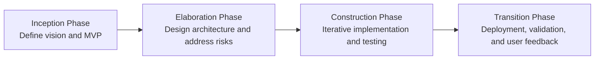
# 2. Current System

Most people currently rely on three approaches to evaluate the credibility of online content:

1. **Manual Verification:**
Readers independently search multiple sources, compare information, and try to determine whether a claim is true. This process is slow, inconsistent, and depends heavily on the reader’s skill and available time.

2. **External Fact-Checking Websites:**
Users leave the article, search fact-checking platforms, and hope the specific claim has already been reviewed. These services cannot keep up with the volume of new content and rarely provide real-time analysis.

3. **Passive Browser Notifications or Plugins:**
Some tools flag websites with low reliability scores, but they evaluate at the domain level, not the individual claims inside an article. These tools do not break down truthfulness or bias on a sentence-by-sentence basis.

Veritas improves on these systems in several ways:

1. **Real-Time In-Article Claim Analysis:**
Instead of checking a whole website or asking users to look elsewhere, Veritas analyzes the specific claims inside the article while the user is reading it.

2. **Automated Evidence Retrieval and Scoring:**
The system uses a research-driven agent that compares each claim to external evidence and produces both a categorical verdict and numerical scores, giving users more detail than generic reliability labels.

3. **Contextual Annotation:**
Results are embedded directly into the article using badges and tooltips, allowing users to see which claims are trustworthy without leaving the page.

4. **Faster and More Scalable Than Manual Fact-Checking:**
The workflow reduces reliance on human reviewers and allows for immediate evaluation of new or rapidly spreading content.

# 3. Project Plan

This project is developed by a team of three members: Diego Martinez, Christian Cevallos, and Justin Cardenas. Diego serves as both the team lead and an active developer. Christian and Justin focus on development tasks. The team follows a Scrum based planning structure in which work is divided into short iterations that allow continuous feedback and refinement. Diego is responsible for organizing Scrum meetings, defining iteration goals, guiding task assignments, and ensuring that progress aligns with the system vision. Each team member contributes to feature development, testing, and integration within the FastAPI backend, the browser extension, and the Veritas Agent workflow. The team conducts regular stand ups to review accomplishments, identify blockers, and plan next steps. Sprint planning sessions determine feature priorities, sprint reviews track completed functionality, and retrospectives help the team refine its processes. This structure supports a consistent pace of delivery, clear communication, and effective risk management throughout the development cycle.

## 3.1 Project Organization

| Team Member         | Role                      | Responsibilities |
|---------------------|---------------------------|------------------|
| Diego Martinez      | Team Lead / Developer     | Organizes Scrum meetings. Coordinates sprint planning, reviews, and retrospectives. Manages task assignments. Oversees system architecture. Contributes to development of the browser extension, FastAPI backend, and overall integration. |
| Christian Cevallos  | Developer                 | Implements features within assigned sprints. Works on backend logic, claim processing, and extension functionality. Participates in testing and debugging cycles. |
| Justin Cardenas     | Developer                 | Contributes to backend and extension development. Assists with feature implementation, testing, and sprint deliverables. Supports integration and refinement tasks. |

## 3.2 Team Methodology 

| Methodology Element | Description |
|---------------------|-------------|
| Development Model   | Scrum based iterative development with short, structured sprints. |
| Meetings            | Diego leads daily stand ups, sprint planning, sprint reviews, and retrospectives. |
| Work Allocation     | Tasks are assigned per sprint based on priority and team workload. |
| Collaboration       | All members participate in feature development, testing, and integration. |

## 3.3 Hardware Requirements

| Component        | Minimum Requirement                                   | Recommended Requirement                                   | Purpose                                 |
|-----------------|--------------------------------------------------------|----------------------------------------------------------|-----------------------------------------|
| CPU             | Dual core processor                                   | CPU with four or more cores                             | Running browser, IDE, FastAPI server    |
| RAM             | 8 GB                                                  | 16 GB or more                                           | Smooth multitasking during development  |
| Storage         | 256 GB free disk space                                | 512 GB or more                                          | Source code, dependencies, logs         |
| Network         | Stable broadband internet connection                  | High speed connection                                   | Agent calls, dependency downloads       |
| Display         | Single monitor with 1080p resolution                  | Dual monitors with 1080p or higher resolution           | Viewing code, browser, and logs at once |
| Test Devices    | One desktop or laptop running a supported browser     | Multiple machines or virtual machines for cross testing | Verifying extension behavior            |


## 3.4 Software Requirements

| Category              | Software / Tool                       | Version or Equivalent          | Usage                                           |
|-----------------------|---------------------------------------|--------------------------------|-------------------------------------------------|
| Operating System      | Windows, macOS, or Linux              | Recent stable release          | Development environment                         |
| Web Browser           | Google Chrome                         | Current stable version         | Running and testing the browser extension       |
| Browser Dev Tools     | Chrome Developer Tools                | Built in                       | Inspecting DOM, debugging the extension         |
| Programming Language  | Python                                | Version 3.10 or later          | FastAPI backend and integration with ADK        |
| Backend Framework     | FastAPI                               | Current stable version         | REST API that connects extension and agent      |
| Package Manager       | pip                                   | Current stable version         | Installing Python dependencies                  |
| Agent Platform        | Google Cloud ADK or equivalent        | Current environment version    | Veritas analysis agent that evaluates claims    |
| Extension Stack       | JavaScript, HTML, CSS                 | ES6 or later                   | Building the Chrome extension UI and logic      |
| Node Ecosystem        | Node.js and npm or yarn               | Current LTS                    | Tooling, bundling, and optional build scripts   |
| IDE or Editor         | VS Code, IntelliJ, PyCharm, or similar| Current stable version         | Writing and managing code                       |
| Version Control       | Git                                   | Current stable version         | Source control and collaboration                |
| Repository Hosting    | GitHub or similar                     | Web account                    | Remote repository and issue tracking            |
| API Testing Tools     | curl or REST client plugin            | Any modern version             | Testing FastAPI endpoints manually              |
| Documentation Tools   | Markdown and Mermaid support          | GitHub native                  | Project documentation and workflow diagrams     |

# 4. Use Cases

## 4.1 Use Case 1 – Launch Extension on Article
**Use Case ID:** `VER-MVP-001-LaunchExtension`  
**Level:** System-level end-to-end  

**User Story:**  
As a news reader, I want to launch Veritas while viewing an article so that I can request in-place credibility analysis.

---

**Actor:**  
User

**Pre-Conditions:**  
- Veritas extension is installed and enabled  
- User is viewing a supported article page  
- Extension has permission to run on the site  

**Trigger:**  
User clicks the Veritas extension icon.

**System Behavior:**  
1. Extension opens its interface  
2. Extension verifies the current page is eligible for analysis  
3. Analysis session is initialized  

**Post-Conditions:**  
- An analysis session has begun for the active article  

**Alternate Flow:**  
- User opens the extension but closes it before analysis starts  

**Extensions:**  
- Keyboard shortcut activation (future enhancement)  

**Exceptions:**  
- Extension is blocked on the current site  

**Concurrent Use:**  
- Multiple tabs may activate this use case independently  

**Decision Support:**  
- Frequency: Medium to High  
- Criticality: Medium  
- Risk: Low to Medium  

**Constraints:**  
- UI should open in under one second  
- Interaction should require no more than one or two user actions  
- Implemented using standard browser extension action entry point  

---

## 4.2 Use Case 2 – Capture Article Source
**Use Case ID:** `VER-MVP-002-CaptureArticleSource`  
**Level:** Internal system process  

**User Story:**  
As the Veritas extension, I want to identify the article’s publisher or source so that credibility analysis can incorporate source context.

---

**Actor:**  
Veritas Browser Extension

**Pre-Conditions:**  
- Use Case 1 has started  
- Content script has access to the DOM  

**Trigger:**  
Metadata capture phase begins  

**System Behavior:**  
1. Inspects page metadata for publisher or site name  
2. Extracts source from structured metadata when available  
3. Falls back to domain-based source identification  
4. Normalizes the source name into a consistent format  
5. Attaches source to article metadata  

**Post-Conditions:**  
- Article source is captured or marked as unknown  

**Alternate Flow:**  
- Source inferred solely from domain name  

**Extensions:**  
- Source reputation profiling (future)  

**Exceptions:**  
- Conflicting or ambiguous source metadata  

**Concurrent Use:**  
- Can execute across multiple tabs  

**Decision Support:**  
- Frequency: Once per analysis  
- Criticality: Medium to High  
- Risk: Medium  

**Constraints:**  
- Must avoid false attribution  
- Must not significantly delay ingestion  

---

## 4.3 Use Case 3 – Capture Article Publication Date
**Use Case ID:** `VER-MVP-003-CapturePublicationDate`  
**Level:** Internal system process  

**User Story:**  
As the Veritas extension, I want to capture the article’s publication date so that analysis can account for timeliness and context.

---

**Actor:**  
Veritas Browser Extension

**Pre-Conditions:**  
- Article page is loaded  
- Metadata or visible date exists  

**Trigger:**  
Metadata capture phase begins  

**System Behavior:**  
1. Searches metadata for publication timestamps  
2. Parses structured data timestamps  
3. Attempts visible date extraction from the article body  
4. Normalizes the date into a standard timestamp format  
5. Attaches publication date to article metadata  

**Post-Conditions:**  
- Publication date is captured or marked unavailable  

**Alternate Flow:**  
- Uses last-modified date when publication date is missing  

**Extensions:**  
- Confidence scoring for extracted dates (future)  

**Exceptions:**  
- Invalid or conflicting date formats  

**Concurrent Use:**  
- Can run across multiple tabs  

**Decision Support:**  
- Frequency: Once per analysis  
- Criticality: Medium  
- Risk: Low to Medium  

**Constraints:**  
- Must handle international date formats  
- Parsing must be deterministic  

---

## 4.4 Use Case 4 – Capture Article Text
**Use Case ID:** `VER-MVP-004-CaptureArticleText`  
**Level:** Internal system process  

**User Story:**  
As the Veritas extension, I want to capture the visible article text and URL so that relevant content can be analyzed.

---

**Actor:**  
Veritas Browser Extension

**Pre-Conditions:**  
- Use Case 1 has started  
- Content script can access the DOM  

**Trigger:**  
Analysis is requested by the user  

**System Behavior:**  
1. Identifies the primary article container  
2. Extracts visible article text  
3. Removes non-article elements  
4. Captures URL and associated metadata  
5. Prepares data for backend submission  

**Post-Conditions:**  
- Cleaned article text and metadata are ready for transfer  

**Alternate Flow:**  
- Fallback extraction from the entire page body  

**Extensions:**  
- Site-specific extraction rules (future)  

**Exceptions:**  
- Empty or invalid extraction result  

**Concurrent Use:**  
- Can run independently across multiple tabs  

**Decision Support:**  
- Frequency: Once per analysis  
- Criticality: High  
- Risk: Medium  

**Constraints:**  
- Should not disrupt page layout  
- Extraction must complete quickly  

---

## 4.5 Use Case 5 – Send Article Data to Backend
**Use Case ID:** `VER-MVP-005-SendArticleDataToBackend`  
**Level:** Internal system process  

**User Story:**  
As the Veritas extension, I want to send the captured article data to FastAPI so that the article can be processed.

---

**Actor:**  
Veritas Browser Extension

**Pre-Conditions:**  
- Article data is captured  
- Backend endpoint is configured  

**Trigger:**  
Extension initiates the analysis request  

**System Behavior:**  
1. Forms a JSON payload with article text and metadata  
2. Sends a POST request to the FastAPI endpoint  
3. Updates the UI to a processing state  

**Post-Conditions:**  
- Backend has received or attempted to receive the payload  

**Alternate Flow:**  
- Retry once if network issues occur  

**Extensions:**  
- Support for authentication headers (future)  

**Exceptions:**  
- HTTP errors or request timeouts  

**Concurrent Use:**  
- Can be executed from multiple tabs concurrently  

**Decision Support:**  
- Frequency: Once per analysis  
- Criticality: High  
- Risk: Medium  

**Constraints:**  
- User must see a clear indication that analysis has begun  

---

## 4.6 Use Case 6 – Validate Incoming Article Data
**Use Case ID:** `VER-MVP-006-ValidateArticleData`  
**Level:** Internal system process  

**Actor:**  
FastAPI Backend

**Pre-Conditions:**  
- POST request contains article data  

**Trigger:**  
FastAPI receives an analysis request  

**System Behavior:**  
1. Validates required fields  
2. Checks text length and structure  
3. Rejects malformed payloads  
4. Forwards valid data to claim extraction  

**Post-Conditions:**  
- Payload is accepted or rejected  

**Alternate Flow:**  
- Text may be truncated if too long  

**Extensions:**  
- Language detection (future)  

**Exceptions:**  
- JSON parsing errors or missing fields  

**Concurrent Use:**  
- Can validate multiple requests concurrently  

**Decision Support:**  
- Criticality: High  
- Risk: Medium  

**Constraints:**  
- Must not add significant delay  

---

## 4.7 Use Case 7 – Extract Claims from Article Text
**Use Case ID:** `VER-MVP-007-ExtractClaims`  
**Level:** Internal system process  

**Actor:**  
FastAPI Claim Extraction Module

**System Behavior:**  
1. Splits text into candidate sentences  
2. Identifies individual claims  
3. Normalizes each claim  
4. Assigns unique claim identifiers  

**Post-Conditions:**  
- Structured claim list prepared  

---

## 4.8 Use Case 8 – Package Structured Claims for Agent
**Use Case ID:** `VER-MVP-008-PackageClaimsForAgent`  
**Level:** Internal system process  

**Actor:**  
FastAPI Backend

**System Behavior:**  
1. Builds agent-ready payload  
2. Includes claim IDs and metadata  
3. Prepares payload for transmission  

---

## 4.9 Use Case 9 – Send Claims to Veritas Agent
**Use Case ID:** `VER-MVP-009-SendClaimsToAgent`  
**Level:** Internal system process  

**Actor:**  
FastAPI Backend

**System Behavior:**  
1. Sends payload to the ADK agent  
2. Applies authentication if required  
3. Handles timeouts or retries  

---

## 4.10 Use Case 10 – Perform Evidence-Based Analysis
**Use Case ID:** `VER-MVP-010-AgentEvidenceAnalysis`  
**Level:** Internal system process  

**Actor:**  
Veritas Analysis Agent

**System Behavior:**  
1. Evaluates each claim against gathered evidence  
2. Assigns verdicts and scores  
3. Generates explanations  

---

## 4.11 Use Case 11 – Receive Analysis Results from Agent
**Use Case ID:** `VER-MVP-011-ReceiveAgentResults`  
**Level:** Internal system process  

**Actor:**  
FastAPI Backend

**System Behavior:**  
1. Parses agent response  
2. Validates result structure  
3. Prepares results for extension delivery  

---

## 4.12 Use Case 12 – Receive Backend Results in Extension
**Use Case ID:** `VER-MVP-012-ReceiveBackendResults`  
**Level:** Internal system process  

**Actor:**  
Veritas Browser Extension

**System Behavior:**  
1. Parses backend response  
2. Stores results locally  
3. Updates UI state  

---

## 4.13 Use Case 13 – Annotate Article with Verdict Indicators
**Use Case ID:** `VER-MVP-013-AnnotateArticle`  
**Level:** System-level end-to-end  

**Actor:**  
User via Veritas Browser Extension

**System Behavior:**  
1. Maps claims to article text  
2. Inserts visual indicators  
3. Displays verdict details on interaction  

---

## 4.14 Use Case 14 – Manage User-Friendly Settings
**Use Case ID:** `VER-MVP-014-ManageUserSettings`  
**Level:** System-level UI interaction  

**Actor:**  
User

**System Behavior:**  
1. Displays settings interface  
2. Loads current preferences  
3. Allows user to modify settings  
4. Saves changes automatically  

**Post-Conditions:**  
- Preferences are applied to future analyses  


# 5. Use Case Diagram

### Figure 3.

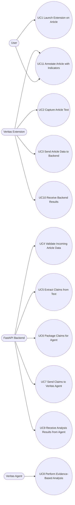
# 6. Class Diagram
### Figure 4.

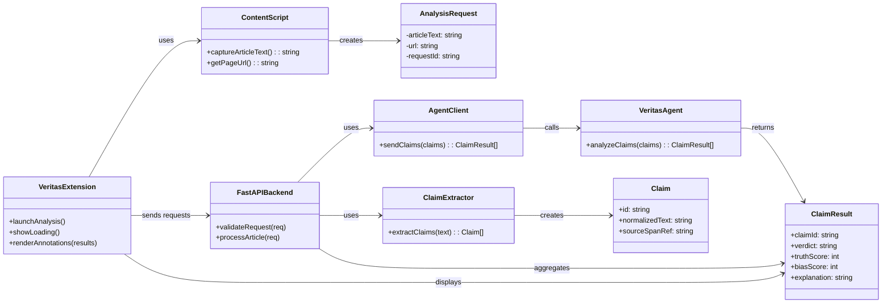
# 7. Sequence Diagrams
## 7.1 UC1 - `VER-MVP-001-LaunchExtension`
### Figure 5.
```mermaid
sequenceDiagram
    autonumber
    actor User
    participant Extension as "Veritas Extension"

    User->>Extension: Click Veritas icon
    Extension->>Extension: Check if page is eligible
    Extension->>Extension: Initialize analysis session
    Extension-->>User: Show loading / analysis started UI
  ```


## 7.2 UC2 - `VER-MVP-002-CaptureArticleText`  
### Figure 6.
```mermaid
sequenceDiagram
    autonumber
    actor User
    participant Extension as "Veritas Extension"
    participant CS as "Content Script"

    User->>Extension: Request analysis
    Extension->>CS: Capture article text + URL
    CS->>CS: Identify article container
    CS->>CS: Extract and clean visible text
    CS-->>Extension: Return cleaned text + URL
    Extension->>Extension: Store article payload
```


## 7.3 UC3 - `VER-MVP-003-SendArticleDataToBackend` 
### Figure 7.
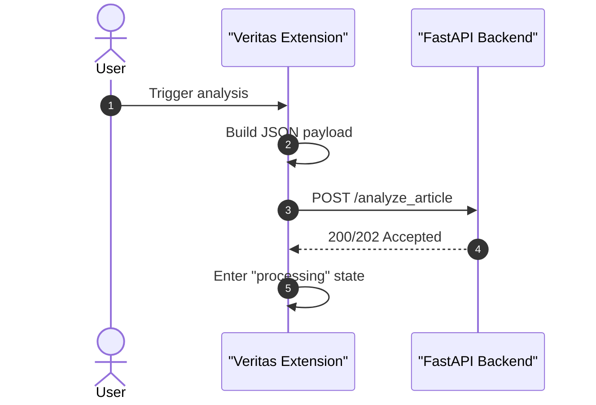


## 7.4 UC4 -  `VER-MVP-004-ValidateArticleData`  
### Figure 8.
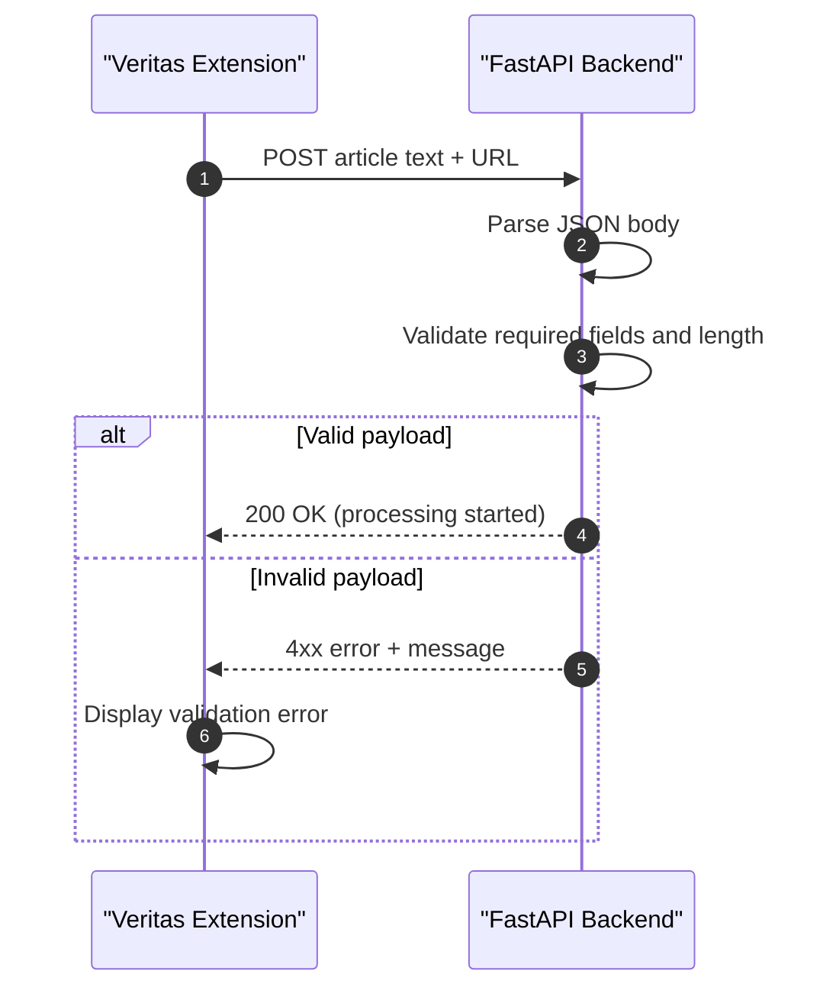


## 7.5 UC5 - `VER-MVP-005-ExtractClaims`  
### Figure 9.
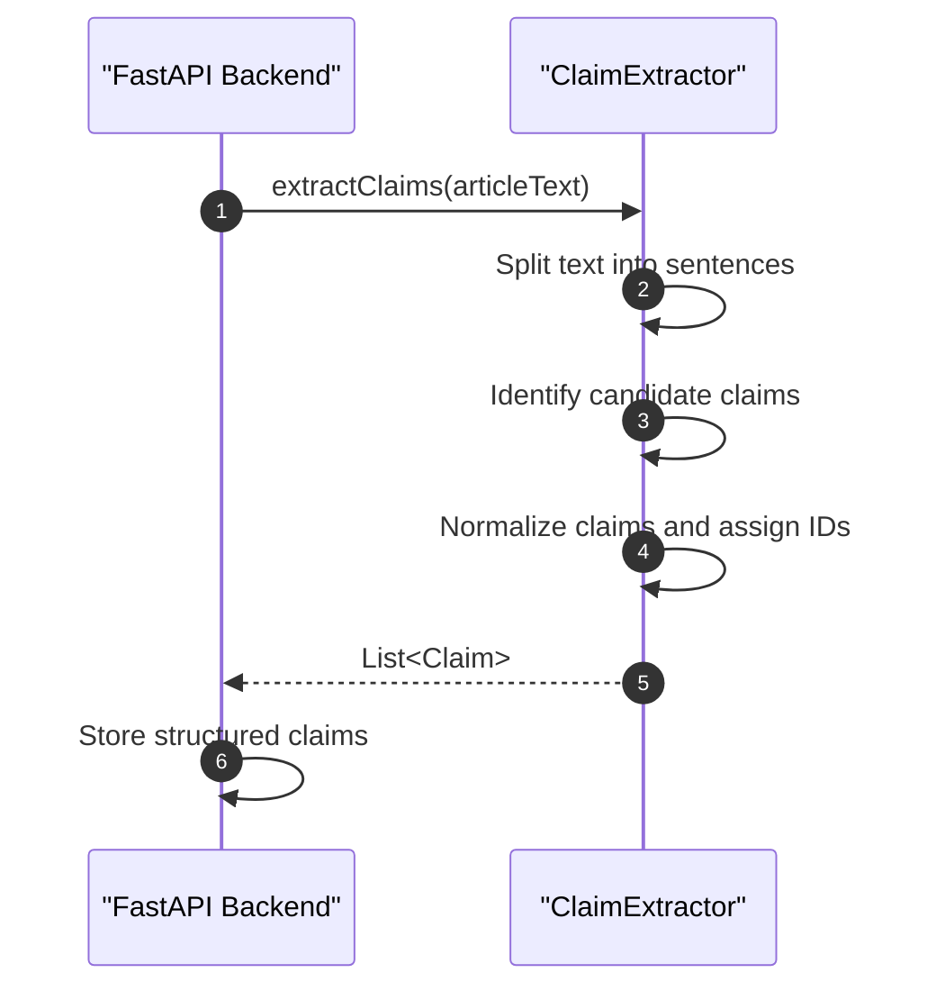


## 7.6 UC6 - `VER-MVP-006-PackageClaimsForAgent`  
### Figure 10.
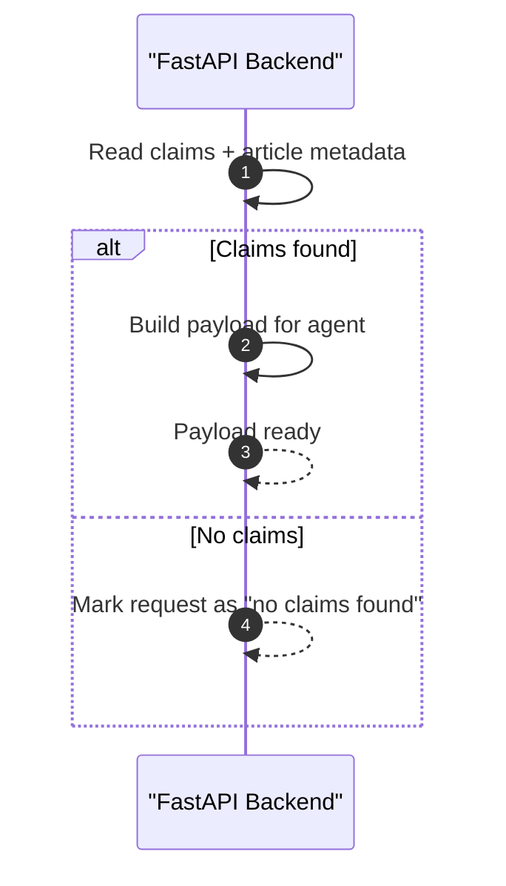


## 7.7 UC7 - `VER-MVP-007-SendClaimsToAgent`  
### Figure 11.
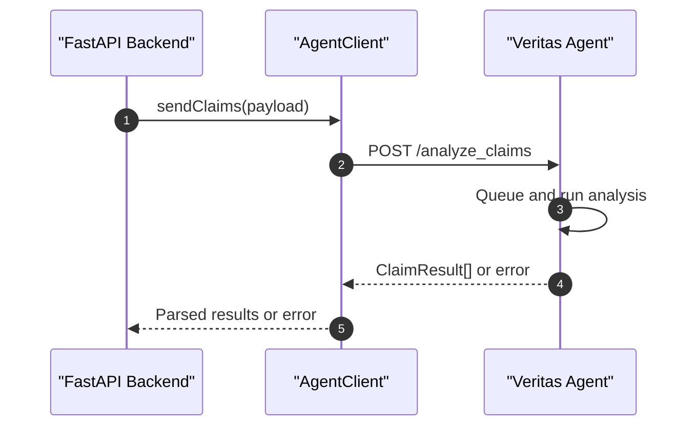


## 7.8 UC8 - `VER-MVP-008-AgentEvidenceAnalysis`  
### Figure 12.
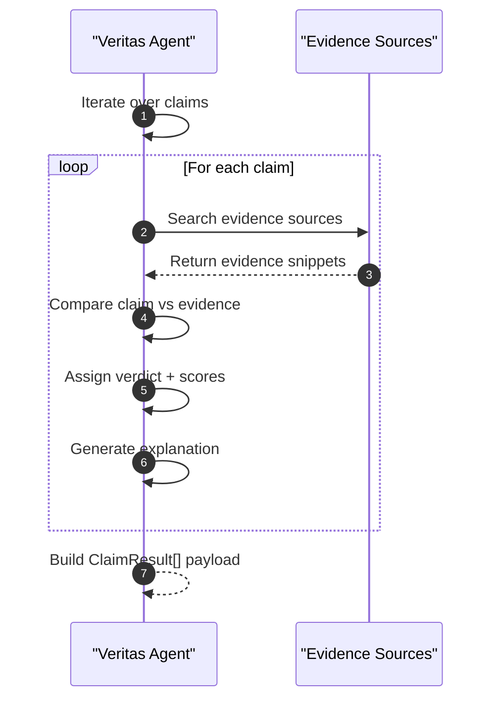


## 7.9 UC9 - `VER-MVP-009-ReceiveAgentResults`
### Figure 13.
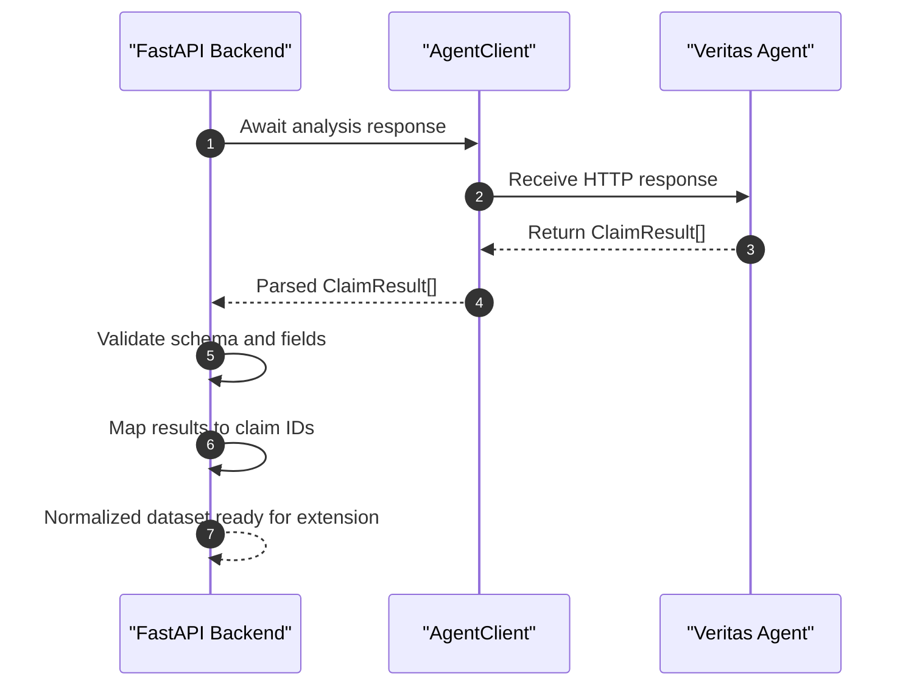


## 7.10 UC10 - `VER-MVP-010-ReceiveBackendResults`  
### Figure 14.
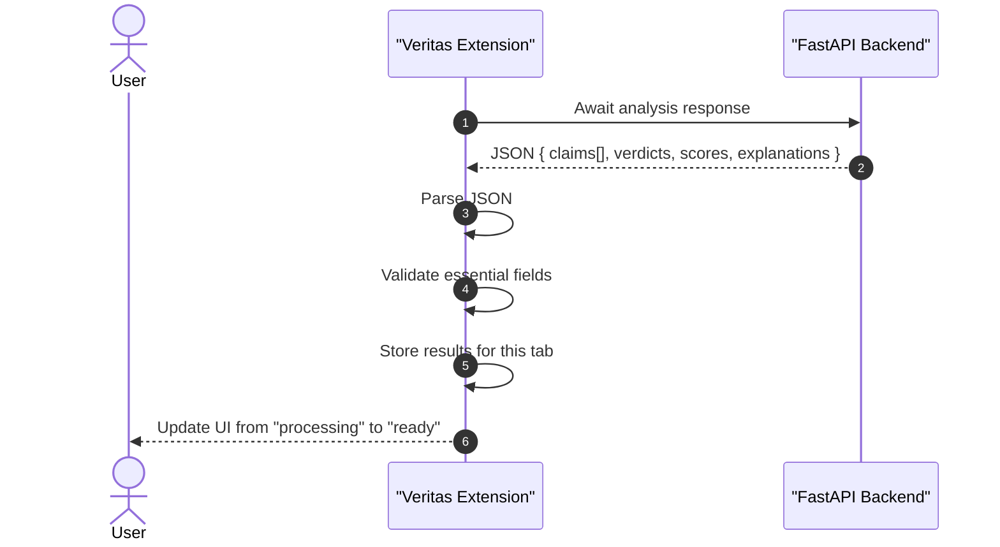


## 7.11 UC11 - `VER-MVP-011-AnnotateArticle` 
### Figure 15.
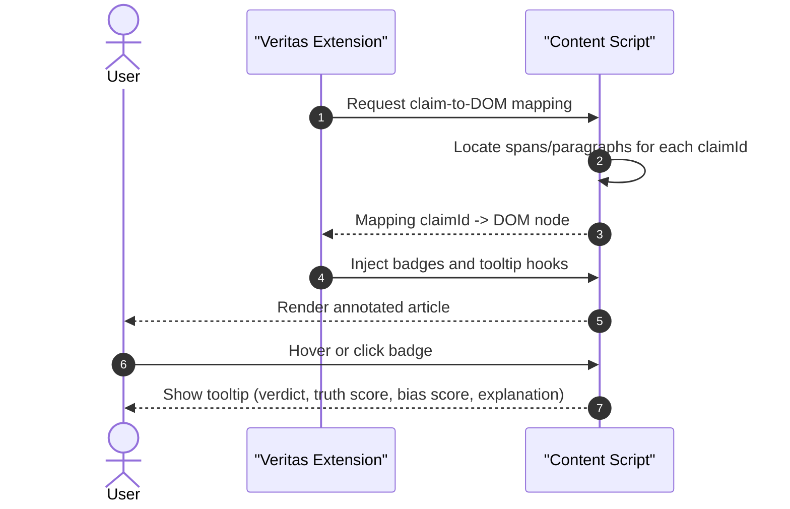


